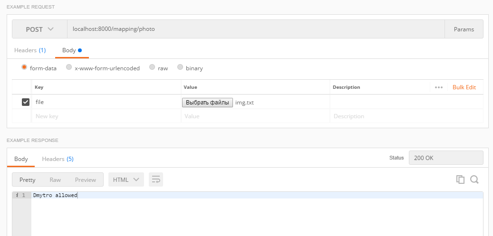

# Normal Smart Device

### Technical white paper

Authors: Normal Team - Dmytro Koziy, Inesa Hermaniuk, Nazar Mamchur 

Published: May 2018  

Applies to: Normal Smart Device    

Summary: This paper provides an overview of how Normal 
Smart Device users can set up the person identification smart system based on a Raspberry Pi 3, using this API.

### Getting Started with Normal Smart Device API
* <a href="#1" style="font-size: 1rem;">Getting Started with Raspberry Pi</a>
1. <a href="#1.1">Creating RESTful client on the Raspberry</a>
2. <a href="#1.2">Face detection</a>

* <a href="#2" style="font-size: 1rem;">The server with recognition algorithm</a>
1. <a href="#2.1">Creating DataSet</a>
2. <a href="#2.2">Face Recognition</a>
3. <a href="#2.3">How to run the server?</a>


### Sequence diagram and diagram of classes in this system
   

  

<h2 id="1">Getting Started with Raspberry Pi</h2>

This section provides an information to help you succesfully set up Raspberry Pi to get a powerful portable camera.
### Prerequisites:
1. Raspberry Pi 3   
2. MicroSD card with cappacity 8GB or more
3. USB webcam

* Set up your Raspberry Pi 3 - install OS by following <a href = "https://www.raspberrypi.org/help/noobs-setup/2/">this guide</a>
* Install Python 3.6
``` terminal
$ sudo apt-get install python-dev
$ curl -O https://bootstrap.pypa.io/get-pip.py
$ sudo python get-pip.py
```
* Install numpy 
``` terminal
$ pip install numpy 
```
* Install OpenCV by following <a href = "https://www.pyimagesearch.com/2017/09/04/raspbian-stretch-install-opencv-3-python-on-your-raspberry-pi/">this guide</a> 

* Install git
``` terminal
$ sudo apt-get install git
``` 


<h2 id="1.1"> Creating RESTful client on the Raspberry </h2>

1. Download folder with code from Github <a href = "https://github.com/Dmytruto/NormalSmartDevice">repository</a>.
``` terminal
$ cd
$ mkdir NormalDir
$ cd NormalDir
$ git init
$ git config core.sparsecheckout true
$ echo Dmytruto/NormalSmartDevice/tree/InesaBranch/Device >> .git/info/sparse-checkout
$ git remote add origin -f https://github.com/Dmytruto/NormalSmartDevice
$ git pull origin master
```
2. Make program run at a startup:  
* Open rc.local file:
``` terminal
$ sudo nano /etc/rc.local
``` 
* Add the following line there
``` terminal
sudo python /home/NormalDir/detection.py &
```
<h2 id="1.2"> Face detection  </h2>

### Import detection.py 
You need to import module in a file you want to use it in
``` python
import NormalDir.detection as FDR
```
### Image preprocessing
``` python
FDR.detect(img)
```
<strong>Parameter:</strong> img - image, where you want to detect a face and crop it out. 
<strong>

Return type</strong> - numpy.array 

The function <strong>detect(img)</strong> detects face on an image and returns a croped and grayScaled image of a face if it was detected, or a numpy.array([0]) if not. 

### Take photos
``` python
FDR.process()
```
<strong>Parameter:</strong> void   
<strong>Return type</strong> - void

The function <strong>process()</strong> contains a <strong>while True </strong> loop which takes 2 photos on webcam per second, converts an image to the base64 String.
### Make request to the server
``` python
FDR.request(str)
```

<strong>Parameter:</strong> str - String, you want to send to the server   

The function <strong>request(str)</strong> sends request with the str String to the server and returns its response.


<h2 id="2"> The server with recognition algorithm</h2>

This section provides an information to help you succesfully set up a server, which can recognize a human face and determine if this person is in the data base.

### Prerequisites
1. Install python 3.6.
2. Install, create and activate your virtual environment in the <strong> Recognition </strong> folder by following <a href = "https://virtualenv.pypa.io/en/stable/installation/">this guide</a>:

3. Install the required modules: 
```terminal 
Django==2.0.5 
djangorestframework==3.8.2
opencv-python==3.4.0.12 
opencv-contrib-python==3.4.0.12
```
### Clone the Repository
1. Choose and go to the directory where you want the cloned directory to be made.(It must be the same folder where you want to use this project).
2. Download <strong> Recognition </strong>folder with code from Github <a href = "https://github.com/Dmytruto/NormalSmartDevice">repository</a>.
``` terminal
$ git init
$ git config core.sparsecheckout true
$ echo Dmytruto/NormalSmartDevice/tree/InesaBranch/Recognition >> .git/info/sparse-checkout
$ git remote add origin -f https://github.com/Dmytruto/NormalSmartDevice
$ git pull origin master
```
<h2 id="2.1"> Creating DataSet</h2>

 ### Import CreateTrainingDataAndTrainModel.py
 First of all you need to import our module in file where you want to use it.
  ```python
  import NormalSmartDevice.FacialRecognition.CreateTrainingDataAndTrainModel as CTD
  ```
### Next step
This function creates a directory named faces which will be contain a sub folders with photo set. In input this function takes the directory name and creates the subfolder with inputted name. 
```python 
  CTD.create_directory(sub_directory_name)
```
### Exstracting face from the image
 In input this function has the image. if this image contains faces, function will returns grayscaling cropped face from this image.else it will return emty list.
 ```python
 CTD.face_extractor(img)
 ```
 ### Take a photos
 This function reads images from your web cam and if face is on image it saves the image in subfolder that you have already created. In input this function takes number of photo which you want to be in your data set.
 ```python
 CTD.start_creating_data_set(quantity)
 ```
 ### Train model
This function create histograms from all images in subfolder and save this histogram in json file. In input this method has name of trained model. In order to program work successfully <strong>file_name</strong> must be the same as <strong>sub_directory_name</strong>.
 ```python
CTD.trainModel(file_name)
```
<strong style="font-size: 1.1rem;"> !To create data set and trained model on this data you have to execute this functions in the same order that It had been written on this article!</strong>
 
<h2 id="2.2"> Face Recognition</h2>

 ### Import FaceRecognition.py
 Import reconizer which have already trained on the Data Set.
  ```python
  import NormalSmartDevice.FacialRecognition.FaceRecognition as FR
  ```

### Run Recognizer
In input this function takes human face image and compare it with faces which had been used to create DataSet. If face on the input image is similar to one of the faces in data set, function will return true, else false. 
```python 
  FR.face_recognizer(face_image)
```
<strong style="font-size: 1.1rem;">In order to use face recognizer firstly you need create data set and train model</strong>

<h2 id="2.3"> How to run the server? </h3>
There are two possible ways how to run server in your computer:

* <strong>Using terminal</strong>
1. Activate your virtual environment.
2. Move to the <strong> server </strong> folder and run the following command:
```terminal
  $ python manage.py runserver
```

* <strong>Using PyCharm</strong>
1. Open project, that you cloned.
2. Go to <strong>File - Settings - Project - Project Interpreter</strong> and <strong> add local </strong> interpretener, choosing path to <strong> Scripts/python.exe </strong> in the folder with your virtual environment.
3. Go to <strong>Run - Edit Configurations</strong> and <strong> add new </strong> configuration:
```
  Name: Django Run Server 
        (If there is already configuration with name 'Django Run Server', edit only 'Python interpreter')
  Script path: \your\path\to\Recognition\server\manage.py
  Parameters: runserver
  Python interpreter: *choose that, what you have created*
``` 
4. Run 'Django Run Server'.


### Valid request
Server is mapping a POST request with a text file, in which there is an encoded photo, by the method <strong>post</strong>.
 ```python
def photo(request):
    if request.method == 'POST' and request.FILES['file']:
```
Request shoud be sent to <strong>http://{host}:{port}/mapping/photo</strong>. If server is run on the local machine, this url looks like ***http://localhost:8000/mapping/photo***.

### Response
 Server sends back one of the <strong>String</strong> responses, which are provided by the recognition algorithm:
 ```
*name* allowed
Not allowed
```
### Example request and response


### Uploaded image
The image, which was got during the last request mapping, is saved to the <strong>uploaded_image</strong> folder.


<strong style="font-size: 1.1rem;"> !Check if everything is installed in the correct folders and all paths are proper!</strong>