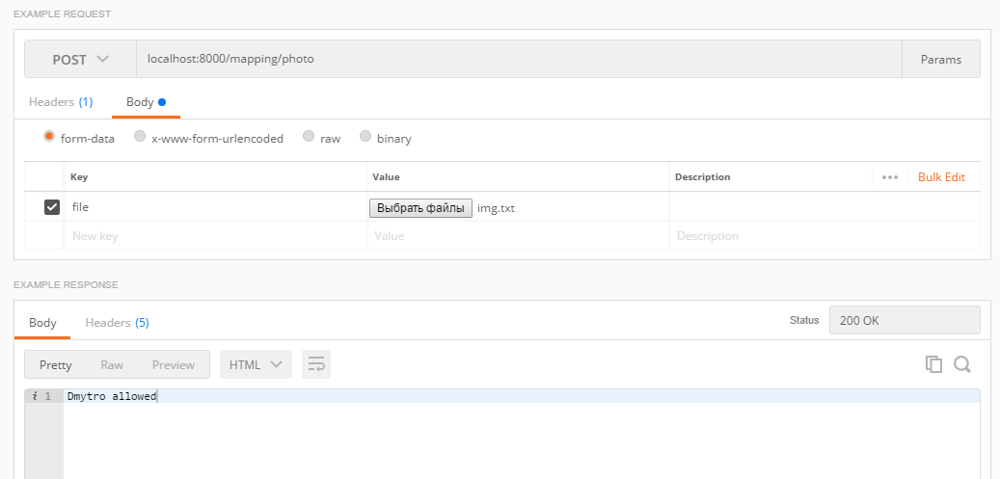

## Prerequisites
 1. Install python 3.6.
 2. Install, create and activate your virtual environment in the <strong> Recognition </strong> folder, using following guide:
https://virtualenv.pypa.io/en/stable/installation/
 3. Install the required modules:
 ```terminal
Django==2.0.5
djangorestframework==3.8.2
opencv-python==3.4.0.12
opencv-contrib-python==3.4.0.12
 ```

## The ***server*** with recognition algorithm

### How to run?
There are two possible ways how to run server in your computer:

* <strong>Using terminal</strong>
1. Activate your virtual environment.
2. Move to the <strong> server </strong> folder and run the following command:
```terminal
  $ python manage.py runserver
```

* <strong>Using PyCharm</strong>
1. Open project, that you cloned.
2. Go to <strong>File - Settings - Project - Project Interpreter</strong> and <strong> add local </strong> interpretener, choosing path to <strong> Scripts/python.exe </strong> in the folder with your virtual environment.
3. Go to <strong>Run - Edit Configurations</strong> and <strong> add new </strong> configuration:
```
  Name: Django Run Server 
        (If there is already configuration with name 'Django Run Server', edit only 'Python interpreter')
  Script path: \your\path\to\Recognition\server\manage.py
  Parameters: runserver
  Python interpreter: *choose that, what you have created*
``` 
4. Run 'Django Run Server'.


### Valid request
Server is mapping a POST request with a text file, in which there is an encoded photo, by the method <strong>post</strong>.
 ```python
def photo(request):
    if request.method == 'POST' and request.FILES['file']:
```
Request shoud be sent to <strong>http://{host}:{port}/mapping/photo</strong>. If server is run on the local machine, this url looks like ***http://localhost:8000/mapping/photo***.

### Response
 Server sends back one of the <strong>String</strong> responses, which are provided by the recognition algorithm:
 ```
*name* allowed
Not allowed
```
### Example request and response


### Uploaded image
The image, which was got during the last request mapping, is saved to the <strong>uploaded_image</strong> folder.


<strong style="font-size: 1.1rem;"> !Check if everything is installed in the correct folders and all paths are proper!</strong>